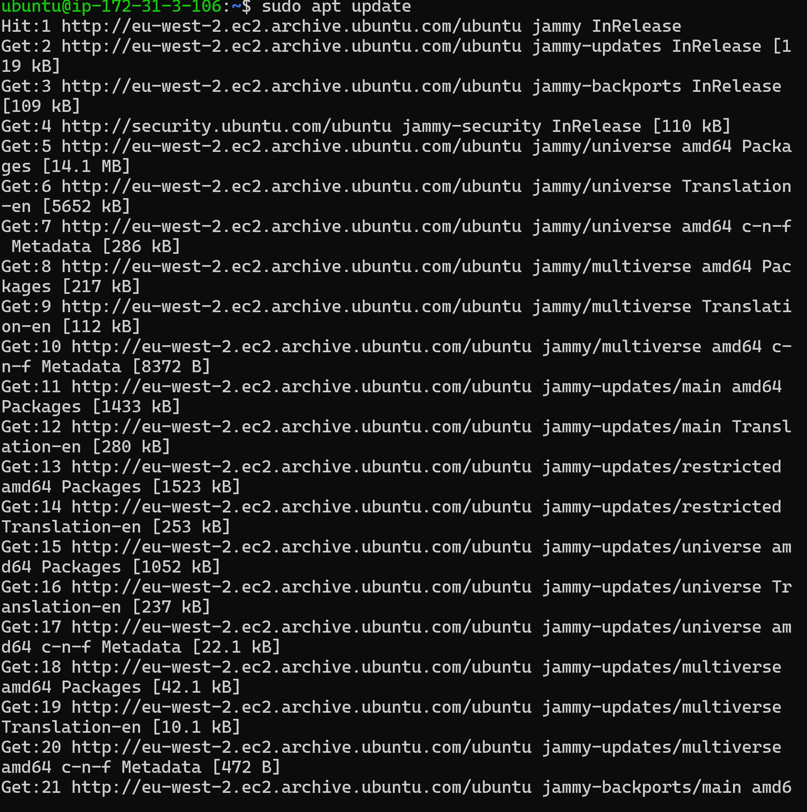

# LAMB 

## Installing apache and updating the firewall

`sudo apt update` to update all the list of packages 

`sudo apt instal apache2` to install the apache package 

`sudo ufw app list` to list all currently available UFW application profiles 

`sudo ufw allow in "Apache"` to allow traffic on port 80 to allow http traffics and `sudo ufw status` to verify the changes i made 

`sudo systemctl status apache2 ` to confrim if the apache is running as a service in our operating system 

`local host and public adress` To access the server locally and also test how our Apache HTTP server can respond to requests from the Internet 

On web 

## Installing mysql

`sudo apt install mysql-serve` to acquire and install mysql server  

`sudo mysql` to login into MYSQL console 

`ALTER USER 'root'@'localhost' IDENTIFIED WITH mysql_native_password BY 'PassWord.1';` setting default password 

`sudo mysql_secure_installation` Changing the default password 

## Installing PHP

`sudo apt install php libapache2-mod-php php-mysql` Installing PHP 

`apt search php- | less` Installing PHP Extension 

## Creating a Virtual Host for my website

`sudo mkdir /var/www/projectlamp` Creating a virtual host and also creating the directory for project lamb, `sudo a2ensite projectlamp` to enable the new virtual host after creating a new configuration 

`nano /var/www/your_domain/index.html` To create an index.html file in the location to test that the virtual host works as expected 

`http://server_domain_or_IP` To access my IP adress on web 

`sudo nano /etc/apache2/mods-enabled/dir.conf` To allow index.php take precedence over index.html on the landing page 

## Testing PHP Processing on your Web Server

`nano /var/www/your_domain/info.php` To create a PHP test script to confirm that Apache is able to handle and process requests for PHP files 

`http://server_domain_or_IP` Web test for PHP 

## Testing Testing databse connection from php

`sudo mysql -p` and `mysql> SHOW DATABASES` To show the databases available on my mysql 

`mysql> INSERT INTO example_database.todo_list (content) VALUES ("My first important item");` and `mysql> SELECT * FROM example_database.todo_list;> SHOW DATABASES` To create Todo_list on MYSQL console 

# LEMB

## Installing the Nginx web server

`sudo apt update` to update all the list of server's packages 

`sudo apt instal nginx` to install the nginx package 

`sudo ufw app list` to check the UFW profile available 

`sudo ufw allow 'Nginx HTTP` to enable port 80 and `sudo ufw status` to verify it 

 `http://13.40.113.52/` to show the landing page of nginx ! [nginx landing page](./images/nginx%20landing%20page.PNG)

`sudo systemctl status apache2 ` to confrim if the apache is running as a service in our operating system 

`local host and public adress` To access the server locally and also test how our Apache HTTP server can respond to requests from the Internet 

On web 

## Installing mysql

`sudo apt install mysql-server` to acquire and install mysql server  

`sudo mysql_secure_installation` Changing the default password 

`sudo mysql` to login into MYSQL console 

## Installing PHP

`sudo apt install php8.1-fpm php-mysql` Installing PHP 

## Configuring Nginx to use the PHP Processor

`sudo mkdir /var/www/your_domain` Creating a virtual host and also creating the directory for project lamb, `sudo chown -R $USER:$USER /var/www/your_domain` to assign ownership of the directory using the $USER, and `sudo nano /etc/nginx/sites-available/your_domain` to create the nano editor for Nginx sites 

`sudo ln -s /etc/nginx/sites-available/your_domain /etc/nginx/sites-enabled/` To activate configuration by linking the configuration file, `sudo unlink /etc/nginx/sites-enabled/default` to unlink the default configuration fromthe directory, `sudo nginx -t` to check for synthax error, `sudo systemctl reload nginx` to reload nginx and  `nano /var/www/your_domain/index.html` to create the html file 

`http://18.134.177.239/` landing page for nginx on web 

## Testing PHP with Nginx

`nano /var/www/your_domain/info.php` to test PHP with Nginx  

`http://18.132.10.118/info.php` Web landing page for PHP with Nginx 

## Testing Database connection from PHP

`SHOW DATABASES;` and `SELECT * FROM example_database.todo_list;`  to create database and also update the added list 

`nano /var/www/your_domain/todo_list.php` to connect to the MySQL database and queries for the content of the todo_list  

